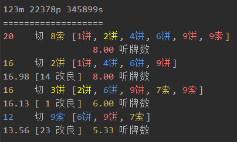

# mahjong-helper

## 安装

`dep ensure -v` 之后 `go build` 编译，运行生成的文件


## 服务端脚本说明

分为两种模式

### 手动档

安装[手动档客户端](https://github.com/EndlessCheng/mahjong-helper-gui)，可用于牌谱分析

或者在命令行输入，比如 `mahjong-helper 34568m 678p 13567s`

### 自动挡

按照[如何获取 WebSocket 收发的消息](#如何获取WebSocket收发的消息)操作

自动化分析会在牌效率上考虑场上已有的牌（含舍牌、副露、宝牌指示牌）；防守方面，简要地按照筋的危险度进行排序，顺带提醒一下 NC OC


## CLI

一向听的判断，显示进张数、类型、改良进张数的加权均值、听牌数的加权均值等




如果听牌型很差，额外提供向听倒退的选择（至多5条）


## 如何获取WebSocket收发的消息

1. 打开开发者工具，找到相关 JS 文件，保存到本地
2. 搜索 `WebSocket`, `socket`，找到 `message`, `onmessage` 等函数
3. 修改代码，使用 `XMLHttpRequest` 将收发的消息发送到（在 localhost 开启的）mahjong-helper 服务器，服务器收到消息后会自动进行相关分析（牌效、攻防、摸切等等）
4. 将修改后的 JS 代码传至个人的 github.io 项目，拿到该 JS 文件地址
5. 安装浏览器扩展 Header Editor，重定向原 JS 文件地址到上一步中拿到的地址，具体操作可以参考[这篇](https://tieba.baidu.com/p/5956122477)
6. 刷新网页

下面说明天凤和雀魂的代码注入点

### 天凤 (tenhou)

1. 搜索 `new WebSocket`，找到下方的 `message` 函数，该函数中的 `a.data` 就是 WebSocket 收到的数据
2. 在该函数末尾添加如下代码

```javascript
var req = new XMLHttpRequest();
req.open("POST", "http://localhost:12121/");
req.send(a.data);
```

### 雀魂 (majsoul)

（目前尚未完全测试到一些特殊情况，可能会产生 bug）

考虑到雀魂的 WebSocket 收到的是封装后的 protobuf 二进制数据，不好解析，于是另寻他路

1\. 搜索 `AddListener2MJ("NotifyPlayerLoadGameReady"` 找到后面的匿名函数 function(e)

2\. 在匿名函数开头（或者末尾）添加如下代码（注意地址是 HTTPS 协议）

```javascript
var req = new XMLHttpRequest();
req.open("POST", "https://localhost:12121/");
req.send(e.data);
```

3\. 全局替换：把所有的 `i.play=function(t){` 替换成 `i.play=function(t){var req=new XMLHttpRequest();req.open("POST","https://localhost:12121/");req.send(JSON.stringify(t));`

4\. 允许本地证书通过浏览器，在浏览器（仅限 Chrome 内核）中输入
```
chrome://flags/#allow-insecure-localhost
```
然后把高亮那一项的 Disabled 改成 Enabled（不同浏览器/版本的描述可能不一样，如果是中文的话点击「启用」按钮）

5\. 重启浏览器
