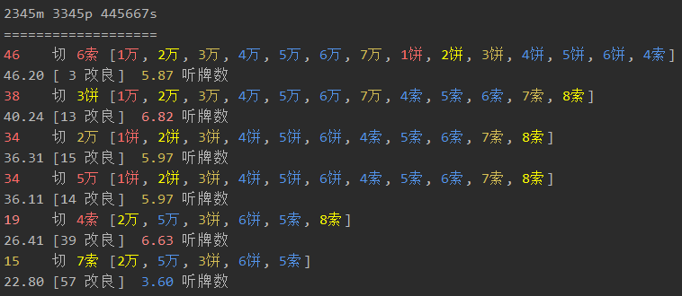

# mahjong-helper

## 安装

`dep ensure -v` 之后 `go build` 编译，运行生成的文件

## 服务端脚本说明

分为两种模式

### 手动档

安装[手动档客户端](https://github.com/EndlessCheng/mahjong-helper-gui)，可用于牌谱分析

### 自动挡

按照[如何获取 WebSocket 收发的消息](#如何获取WebSocket收发的消息)操作

## CLI





## 如何获取WebSocket收发的消息

1. 打开开发者工具，找到相关 JS 文件，保存到本地
2. 搜索 `WebSocket`, `socket`，找到 `message`, `onmessage` 等函数
3. 修改代码，使用 `XMLHttpRequest` 将收发的消息发送到（在 localhost 开启的）mahjong-helper 服务器，服务器收到消息后会自动进行相关分析（牌效、攻防、摸切等等）
4. 将修改后的 JS 代码传至个人的 github.io 项目，拿到该 JS 文件地址
5. 安装浏览器扩展 Header Editor，重定向原 JS 文件地址到上一步中拿到的地址，具体操作可以参考[这篇](https://tieba.baidu.com/p/5956122477)
6. 刷新网页

下面说明天凤和雀魂的代码注入点

### 天凤 (tenhou)

1. 搜索 `new WebSocket`，找到下方的 `message` 函数，该函数中的 `a.data` 就是 WebSocket 收到的数据
2. 在该函数末尾添加如下代码

```javascript
var req = new XMLHttpRequest();
req.open("POST", "http://localhost:12121/");
req.send(a.data);
```

### 雀魂 (majsoul)

1. 搜索 `WebSocket`，找到下方的 `onmessage` 函数，函数入参对象 `e` 中的 `data` 就是 WebSocket 收到的数据
2. 雀魂使用了 HTTPS，修改的代码也要发送给 HTTPS 服务器，可以使用[阿里云提供的免费证书](https://common-buy.aliyun.com/?commodityCode=cas#/buy)（Symantec - 增强型OV SSL - 免费型DV SSL）开启本地服务器
3. 在该函数末尾添加如下代码（注意地址是 HTTPS 协议）

```javascript
var req = new XMLHttpRequest();
req.open("POST", "https://localhost:12121/");
req.send(e.data);
```
